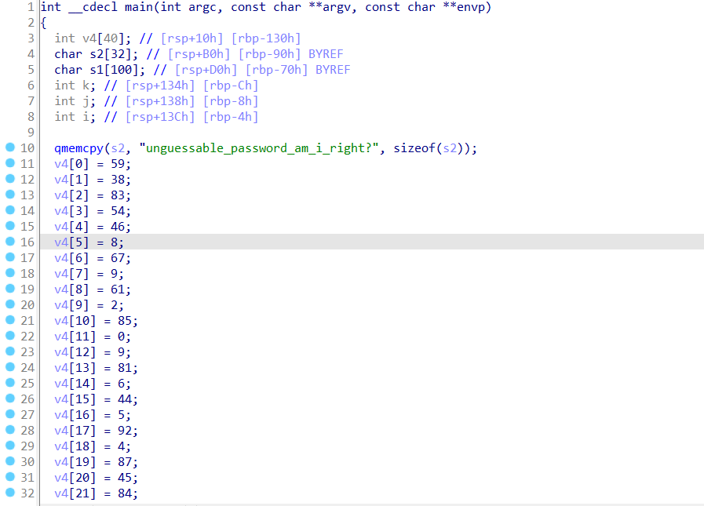

Δίνεται ένα ELF αρχείο. Πριν το τρέξουμε το πετάμε σε μια IDA και κάνουμε generate pseudocode:\
\


\
Τα βήματα που εκτελεί το πρόγραμμα είναι τα εξής:
- Ζητάει ένα input από το χρήστη.
- Πραγματοποιεί κάποια operations στο input και τσεκάρει αν το αποτέλεσμα αυτών των πράξεων παράγει το string `"unguessable_password_am_i_right?"`.
- Αν όχι, τότε τυπώνει το μήνυμα `"Wrong password:("`.
- Αν ναι, τότε κάνει ένα απλό XOR χαρακτήρα προς χαρακτήρα μεταξύ του παραγόμενου string `"unguessable_password_am_i_right?"` και ενός hardcoded πίνακα του οποίου τις τιμές ξέρουμε(φαίνονται στον decompiled κώδικα), και τυπώνει το αποτέλεσμα.

Καταλαβαίνουμε ότι το πιο πιθανό είναι το flag να είναι το τελικό output του προγράμματος. Για να το βρούμε, μπορούμε πολύ απλά να πάρουμε το XOR των τιμών του πίνακα με το γνωστό string `"unguessable_password_am_i_right?"`.\
\
Solver:
```python
v4 = [0]*32
v4[0] = 59
v4[1] = 38
v4[2] = 83
v4[3] = 54
v4[4] = 46
v4[5] = 8
v4[6] = 67
v4[7] = 9
v4[8] = 61
v4[9] = 2
v4[10] = 85
v4[11] = 0
v4[12] = 9
v4[13] = 81
v4[14] = 6
v4[15] = 44
v4[16] = 5
v4[17] = 92
v4[18] = 4
v4[19] = 87
v4[20] = 45
v4[21] = 84
v4[22] = 94
v4[23] = 59
v4[24] = 54
v4[25] = 50
v4[26] = 65
v4[27] = 54
v4[28] = 93
v4[29] = 88
v4[30] = 85
v4[31] = 66

s2 = b"unguessable_password_am_i_right?"

flag = []
for i in range(32):
    flag.append(v4[i] ^ s2[i])
print(bytes(flag))
```

**Σημείωση**: κάποιος μπορεί να δοκιμάζε να βρει τον αρχικό κωδικό αντιστρέφοντας τις πράξεις που θα έπρεπε να αντιστοιχίζουν τον κωδικό στο γνωστό hardcoded string. Αυτό είναι ούτως ή αλλως δυσκολότερο από το να κάνεις το απλό XOR, αλλά στη συγκεκριμένη περίπτωση δεν υπάρχει **καν** τέτοιος κωδικός! ;)
